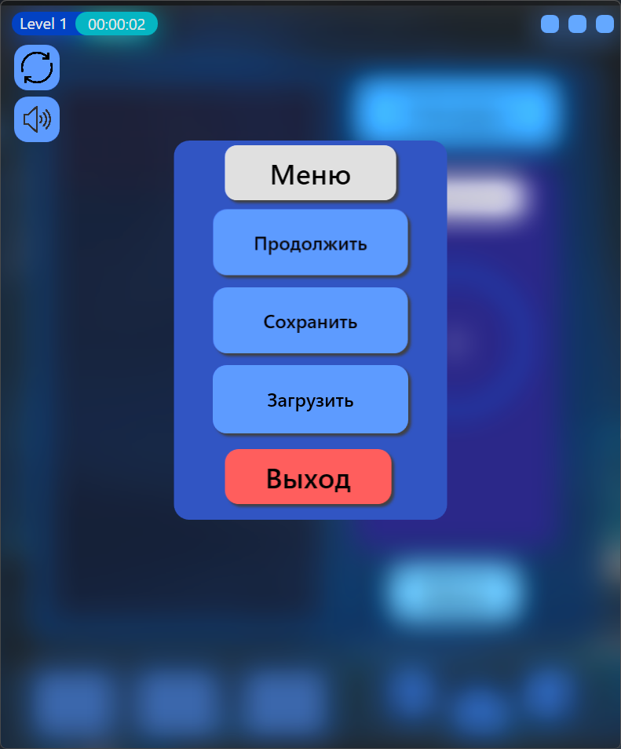

# 🎮 Tetris on WPF

A classic Tetris game written in C# using WPF (.NET). A simple project demonstrating basic game logic, UI implementation in WPF, and data persistence.

### ✨ Key Features

*   **🕹️ Classic Gameplay:** Levels, scoring, and increasing speed with each level.
*   **Ghost Piece:** A projection of the falling piece helps you aim.
*   **🔄 Piece Swap:** Don't like the current piece? Right-click to swap it with the next one (at a small point cost!).
*   **💾 Save & Load:** You can pause your game and resume it later.
*   **🏆 High Scores Table:** Saves the best results.
*   **🔊 Sound Effects:** It has sound! And you can mute it in the menu.
*   **In-Game Menu:** Allows you to restart the game or toggle the sound.

### **💻 Tech Stack:**
*   **Platform:** .NET
*   **Framework:** Windows Presentation Foundation (WPF)
*   **Language:** C#

---

## Gameplay and Mechanics

### Main Objective
The player must control falling shapes (tetrominoes) to form solid horizontal lines. Completed lines disappear, earning the player points. The game ends when the pieces stack up to the top red line of the playfield.

### ⌨️ Controls
*   **Move Left/Right:** `←` / `→` on-screen buttons or by hovering the mouse.
*   **Soft Drop (Speed up fall):** `↓` on-screen button or a left mouse click.
*   **Rotate Piece:** Mouse wheel.
*   **Swap Piece:** Right mouse button. Allows you to swap the current piece with the next one once per turn. This action may cost some points.
*   **Ghost Piece:** A semi-transparent silhouette of the piece is displayed at the bottom of the playfield, showing its final position. This helps the player to place blocks more accurately.

### Scoring and Levels System
*   **Score:** Points are awarded for clearing lines and successfully placing a piece. The more lines cleared at once, the more points the player receives.
*   **Levels:** As the score or number of cleared lines increases, the game level goes up. With each new level, the falling speed of the pieces increases, making the gameplay more challenging. The current level and score are displayed on the side panel.

---

## Core Functions

  

### Save and Load Game
*   **Save:** The player can save the current game state at any moment via the menu. The state includes the block layout on the field, the current score, level, and the next piece. The data is serialized and saved to a local file.
*   **Load:** From the main menu, you can load the last saved game, restoring all progress.

### High Scores Table
The game maintains a local high scores table. After the game ends, if the player's score makes it to the top, they are prompted to enter their name. The high scores table can be viewed from the main menu or from the game screen by clicking the **"Рекорды" (Records)** button.

### Menu and Settings
The game screen features a **"Меню" (Menu)** button, which provides access to the following options:
*   **Start Over:** Resets the current progress and starts a new game.
*   **Save Game:** Saves the current session.
*   **Toggle Sound:** Allows you to manage the in-game sound effects.
*   **Exit to Main Menu:** Returns to the start screen.

### Audio
The project includes sound effects for key game events:
*   Piece movement and rotation.
*   Piece landing.
*   Line clear.
*   Game over.

---

### 🚀 How to Run

1. Download the release.
2. Run the .exe file.

**or**

1.  Clone the repository.
2.  Run the .exe file.
